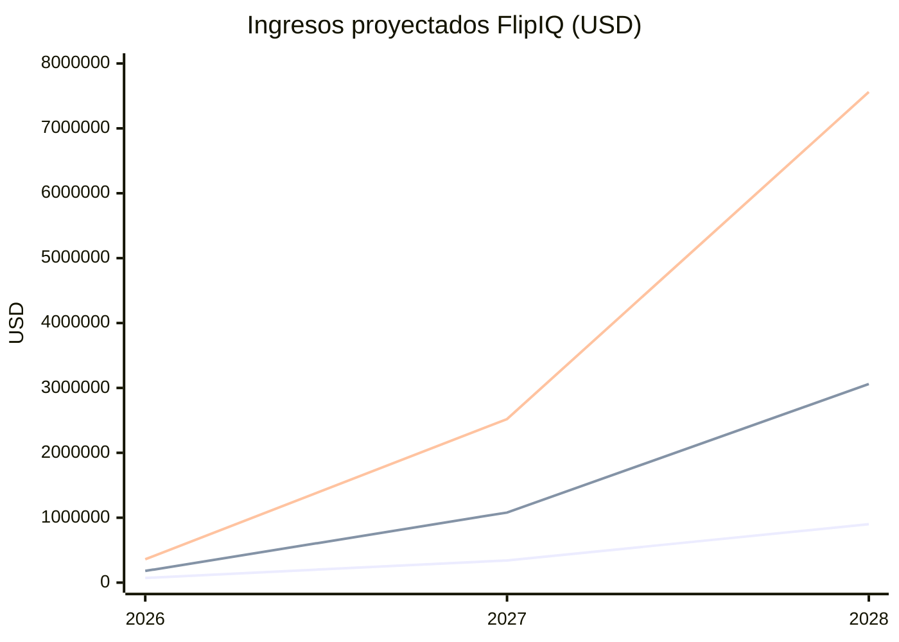
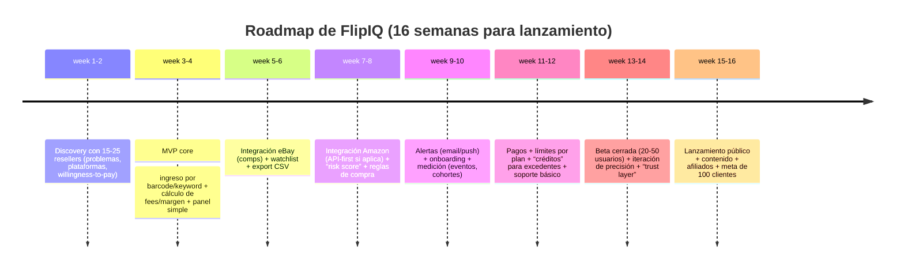

# FlipIQ: investigación de mercado, modelo de negocio y plan de ejecución (2026–2028)

## Resumen ejecutivo

FlipIQ es un SaaS orientado a resellers (online arbitrage, retail arbitrage, dropshipping controlado y “flippers” locales) que **evalúa productos antes de comprarlos para revender**, calculando **margen neto**, **riesgo**, **velocidad de venta** y **canales recomendados** (p. ej., Amazon/eBay/social commerce) con una experiencia **mobile‑first (escaneo de código de barras + búsqueda)** y un backend “API‑first” para minimizar dependencia de scraping.

El contexto de mercado es favorable: el mercado global de recommerce está estimado en **US$210.7B (2025)** y proyectado a **US$310.5B (2029)** (crecimiento anual compuesto ~10.2% 2025–2029). citeturn28search4 Además, el “secondhand” en apparel se describe como un “powerhouse” de **US$393B hacia 2030**, con una narrativa clara de adopción y cambio de hábitos. citeturn20view1 En EE. UU., el ecommerce minorista sigue ganando participación: en **2025** se estiman **US$1,233.7B** en ventas retail e‑commerce (16.4% del total de ventas retail), y en **Q4 2025** el e‑commerce representó ~**16.6%** (ajustado) del total. citeturn28search0turn28search3

Para plataformas, entity["company","eBay","online marketplace"] reporta **135M compradores activos** y **2.5B “live listings”** al cierre de 2025, lo que evidencia profundidad de inventario y liquidez del marketplace. citeturn21search1 En entity["company","Amazon","ecommerce platform"], “más del 60%” de las ventas provienen de sellers independientes, y los sellers independientes en EE. UU. promediaron **>US$290K** en ventas anuales (2024), reforzando que existe una base profesional con disposición a pagar por herramientas. citeturn21search7

La tendencia más importante para FlipIQ es **el desplazamiento de discovery hacia social feeds**: el reporte 2026 de entity["company","ThredUp","resale platform"] (con investigación de entity["organization","GlobalData","retail analytics firm"]) indica que **casi 50%** de los compradores descubre su próxima compra secondhand vía social media/creators/influencer feeds. citeturn20view1 En paralelo, entity["company","TikTok","social media platform"] Shop escaló fuerte: estimaciones reportadas por Momentum Works/Tabcut apuntan a **US$15.1B de GMV en EE. UU. (2025)** (+68% YoY). citeturn22search5 Y desde el lado de Meta, un anuncio oficial de 2021 indica que Marketplace puede ayudar a llegar a **“más de 1 billón” (1B) de personas** que lo visitan cada mes. citeturn23search14

Conclusión: el “momento” para FlipIQ no es competir frontalmente con suites complejas, sino **capturar al reseller que quiere decisiones rápidas y accionables**, con “barcode‑first + score de rentabilidad/riesgo + alertas”, y un pricing accesible (≤US$49/mes) que se pague con 1–2 flips exitosos.

---

## Base del equipo y activos reutilizables del GitHub

El insumo “proyectos previos” se basa en una revisión de tu perfil en entity["company","GitHub","code hosting platform"] y repos asociados (inventario/operaciones, backend APIs, apps verticales, microservicios). citeturn2view0turn4view0turn6view0turn10view4

### Señales técnicas relevantes para FlipIQ

Tu repositorio **Supplies‑Order‑Predict** describe un sistema de **gestión de inventario/pedidos** con backend en FastAPI y prácticas típicas de SaaS (API, integración con BD, capa de servicios, analítica). Incluye funcionalidades como registro de productos/proveedores/tiendas, importación CSV y análisis para apoyar decisiones de reabasto, además de autenticación (menciona Auth0) y SQLAlchemy/Pandas para procesamiento. citeturn4view0

**GymAPI** muestra experiencia en backend de un producto con seguridad y multi‑rol: se listan componentes como Auth0, PostgreSQL y features orientados a app real (roles, onboarding, etc.). citeturn6view0

**CantinaGo** está planteado en estilo **microservicios** (varios servicios) y su README lo posiciona como solución modular, una arquitectura útil si FlipIQ separa ingestion de datos, pricing/fees, alertas y “watchlists”. citeturn6view2

Lo más alineado a FlipIQ es **DetailsFoodScanner**: en el frontend (Streamlit) se observa un flujo de **identificación de producto por “barcode”** y la conexión a microservicios (p. ej., “Product Identifier (Barcode)” y un endpoint local), lo que se parece al flujo “escaneo → enriquecimiento de datos → decisión de compra/venta”. citeturn10view4

### Ventaja competitiva derivada de tus proyectos

El patrón común entre esos repos es: **APIs + dominio inventario/operaciones + experiencia de producto con autenticación + (al menos) un flujo de identificación por barcode**. Eso permite que FlipIQ tenga desde el inicio un “núcleo” difícil para un competidor genérico: **(a) cálculo de rentabilidad y rotación, (b) ingestión de inventario/listados, (c) experiencia mobile de escaneo, (d) panel de decisiones**. citeturn4view0turn6view0turn10view4

### Preguntas tipo para concretar “tu” versión de FlipIQ

Datos del usuario **no especificados** (industria previa, mercados donde vendes, presupuesto, tamaño de equipo, experiencia vendiendo, etc.). Para maximizar monetización y reducir riesgo, las preguntas más productivas (6–8) serían:

- ¿En qué países piensas vender FlipIQ primero (EE. UU., México, otros LatAm)? (**no especificado**; afecta idioma, data sources y CAC).
- ¿Qué modelo de reseller apuntas primero: FBA OA/RA, eBay flipping, Facebook Marketplace local, TikTok Shop “product discovery”, dropshipping? (**no especificado**).
- ¿Qué marketplaces son “must‑have” en el MVP (Amazon/eBay/Marketplace/TikTok Shop/MercadoLibre)? (**no especificado**).
- ¿Cuál es tu capacidad de integración con APIs oficiales (tener cuentas seller, tokens, compliance) vs dependencia de scraping? (**no especificado**).
- ¿Cuánto tiempo (semanas) puedes dedicar al MVP y si habrá contratistas? (**no especificado**).
- ¿Tu ventaja comercial: ya tienes audiencia (TikTok/YouTube/communities) o empezarías desde cero? (**no especificado**).
- ¿Ticket objetivo: US$19–49/mes (SMB) vs >US$99/mes (power sellers)? (**no especificado**).
- ¿Cuál es tu tolerancia a riesgo legal/operativo (scraping, bloqueos, reclamos) y tu preferencia por soluciones “API‑first”? (**no especificado**).

---

## Mercado y tendencias

### Tamaño y crecimiento del “recommerce” y secondhand

En agregados globales, un databook de entity["organization","Research and Markets","market research publisher"] estima el mercado global de recommerce en **US$210.7B (2025)** y proyecta **US$310.5B (2029)** con CAGR ~**10.2%** para 2025–2029. citeturn28search4 En paralelo, el reporte 2026 de ThredUp/GlobalData sitúa el “secondhand” global como un mercado que se ha convertido en un “powerhouse” de **US$393B** (proyección hacia 2030), reforzando la escala del fenómeno (aunque su medición está centrada en apparel). citeturn20view1

### Escala del ecommerce y marketplaces como “sustrato” del reseller

En EE. UU., entity["organization","U.S. Census Bureau","us government stats"] reporta que las ventas retail e‑commerce totalizaron **US$1,233.7B en 2025**, y ese año el e‑commerce representó **16.4%** de las ventas retail; en Q4 2025, el e‑commerce fue ~**16.6%** (ajustado por estacionalidad) y el total Q4 fue **US$365.2B** (no ajustado). citeturn28search0turn28search3

En eBay, el Form 10‑K (SEC) al cierre de 2025 indica **135M active buyers** y **2.5B live listings**, además de definir “active buyer” como cuentas que pagaron una transacción en el periodo previo de 12 meses. citeturn21search1 Esto es relevante para FlipIQ porque resellers dependen de **liquidez + inventario visible** para que sus predicciones de rotación funcionen.

En Amazon, la página oficial de estadísticas para vendedores indica que **más del 60%** de las ventas en la tienda de Amazon provienen de sellers independientes y ofrece métricas de desempeño (p. ej., promedios de ventas anuales y conteos de sellers >US$1M). citeturn21search7 Esto sugiere una base de “operadores” que típicamente paga por software si el ROI es claro.

### LatAm como oportunidad “bilingüe” y mobile‑first

Para LatAm, un reporte conjunto de entity["organization","Endeavor","entrepreneur network"] y entity["company","MercadoLibre","latin america marketplace"] (difundido por Reuters) proyecta que el e‑commerce regional alcanzará **US$215.31B en 2026**; también reporta que Argentina, Brasil y México concentran ~85% de ventas regionales y que la región es fuertemente “mobile‑first” (84% de compras vía smartphones), además de una alta sensibilidad a mala experiencia (abandono tras una mala experiencia). citeturn24search0

En México, el Estudio de Venta Online 2025 (versión pública) de entity["organization","AMVO","mexico ecommerce association"] reporta (para retail online) un valor de mercado de **MXN $789.7 mil millones en 2024 (~US$43.1B)** y crecimiento nominal **+20% en 2024**, además de que el canal online representó **14.8%** de las ventas minoristas en 2024. citeturn31view1turn31view2turn31view3 También posiciona a LatAm como segunda región de crecimiento más rápido en ecommerce minorista en 2024 (10.5% en su gráfico), y estima penetración de compradores digitales alta (p. ej., México 84% en su lámina de penetración). citeturn30view0turn30view1

Implicación: una propuesta bilingüe (inglés/español) y optimizada para móvil puede capturar una porción subatendida, especialmente si el producto reduce fricción (escaneo → decisión) y se integra con workflows existentes.

### Tendencias de adquisición: social commerce y “off‑platform discovery”

El reporte 2026 de ThredUp/GlobalData enfatiza que **la compra/venta secondhand se está integrando en comportamientos financieros** y que **la fricción baja con tecnología**, incluyendo el punto (crítico para FlipIQ) de que **casi 50%** de discovery de secondhand ocurre en **social feeds/creators**. citeturn20view1turn20view0

TikTok Shop refuerza la dirección: reportes de Momentum Works/Tabcut estiman US$15.1B GMV en EE. UU. (2025) y crecimiento acelerado. citeturn22search5 Para Marketplace, un anuncio oficial de Meta (2021) indica que Marketplace ayuda a alcanzar “más de 1B” de personas que lo visitan mensualmente (en contexto de Shops y compra dentro del ecosistema). citeturn23search14

Implicación: FlipIQ debe incluir **módulos pensados para discovery social**, aunque el MVP no “lea” TikTok directamente: p. ej., “watchlists”, alertas por precio, y un flujo “pega URL / captura / escanea” que convierta señales sociales en análisis de rentabilidad.

---

## Competencia y oportunidad de posicionamiento

### Panorama competitivo

La competencia relevante se divide en: (a) suites Amazon‑centric (investigación + operación), (b) herramientas de sourcing/arbitrage (escaneo masivo, reverse search), (c) price tracking e historial, (d) herramientas nativas de eBay, y (e) automatización dropshipping.

Tabla comparativa (pricing y features basados en páginas oficiales cuando existen):

| Competidor | Modelo | Pricing publicado (aprox.) | Enfoque | Features más visibles | Punto fuerte / limitación |
|---|---|---:|---|---|---|
| entity["company","Tactical Arbitrage","amazon arbitrage tool"] | Suscripción | Pro ~US$159/mes (legacy); bundle Seller 365 ~US$69/mes | Online arbitrage / sourcing | Exploración de productos para revender, herramientas de sourcing, búsqueda masiva (según su messaging) | Potente pero complejo; orientado a Amazon y a power users; pricing puede variar por bundles/planes citeturn12search0turn12search11 |
| entity["company","Jungle Scout","amazon seller software"] | Suscripción | Starter ~US$49/mes (menciona 2024 plans) | Amazon (investigación/keyword/product) | Product & keyword research, extensión, etc. | Muy establecido en Amazon; menos orientado a “cross‑market flipping” citeturn12search5 |
| entity["company","Helium 10","amazon seller tools"] | Suscripción | Platinum ~US$99/mes; tiers superiores | Amazon ops + research | Suite amplia (research, ops, ads, etc.) | Completa pero cara/“overkill” para flippers; foco Amazon-first citeturn12search2 |
| entity["company","Keepa","amazon price tracker"] | Suscripción | ~€19/mes (membership) | Amazon price history | Price history, alerts, tracking a escala (varios miles de millones de productos según stores/apps) | Gran histórico; no es “decision engine” completo; pricing API no siempre transparente citeturn12search21turn13search23 |
| entity["organization","eBay Product Research (Terapeak)","ebay seller research tool"] | Incluido (según condiciones) | Product Research: sin costo para sellers con Seller Hub; Sourcing Insights requiere Store | eBay | Acceso hasta 3 años de datos de ventas para millones de items; filtros por keyword/condición/ubicación | Excelente para eBay (y gratis); limitado fuera de eBay citeturn15search0turn15search3 |
| entity["company","PriceYak","dropshipping automation tool"] | Suscripción/usage | Free to install (Shopify); cobros por uso según plan | Dropshipping (multi‑market) | Listing creation, repricing, auto‑ordering | Automatiza; no necesariamente optimiza “qué comprar”, sino “cómo operar” citeturn13search12 |
| entity["company","OAXRAY","online arbitrage tool"] | Suscripción | Reportado ~US$99/mes (y planes multi‑meses) | Online arbitrage (Amazon) | Escaneo de páginas y match con listings | Puede tener falsos positivos/limitaciones; pricing no siempre en fuente oficial pública citeturn16search0turn16search1 |
| entity["company","ZIK Analytics","ebay product research tool"] | Suscripción | PRO desde ~US$39.9/mes (según pricing page) | eBay / Shopify / research | Competitor research, keyword/product research | Fuerte en eBay; no necesariamente “barcode-first” ni centrado en rentabilidad neta multi‑canal citeturn13search2 |

### “Gap” claro donde FlipIQ puede ganar

Para monetización y entrada, el hueco más defendible es:

**Mobile‑first + cross‑market decision engine + bilingüe + orientado a ROI neto y riesgo**, no a “más features”. La evidencia de mercado apoya esa dirección:

- Discovery se está moviendo a **feeds sociales** (casi 50% en secondhand), lo que requiere un producto que convierta “señales” (video/URL/escaneo) en decisión rápida. citeturn20view1  
- LatAm y México muestran crecimiento y alta penetración digital y “peso” del canal online (14.8% retail en 2024 en México), lo que abre espacio a una herramienta con experiencia “rápida y móvil”. citeturn31view3turn30view1  
- eBay ofrece research interno muy potente y gratis; por lo tanto FlipIQ no debe “reemplazarlo”, sino **agregar valor**: cross‑listing, cálculo de fees netos por canal, alertas y workflow de sourcing. citeturn15search3  

---

## TAM, SAM, SOM y unit economics

### Definiciones y fórmula base (2026)

Como FlipIQ vende software, es más robusto estimar TAM/SAM/SOM en **usuarios pagadores y ARR**, no en GMV.

- **ARPA (supuesto de modelo)**: US$30/mes (mezcla Pro/Business/Power). *(Supuesto; datos del usuario no especificados.)*  
- Fórmula: `ARR = #usuarios_pagadores × ARPA × 12`.

### TAM/SAM/SOM a 3 años (tres escenarios)

Estos escenarios se alinean con: (a) escalas observadas en marketplaces, (b) willingness-to-pay implícito por pricing competitivo, y (c) el hecho de que “recommerce/secondhand” opera a escala global. citeturn21search1turn21search7turn28search4turn20view1

| Escenario | TAM (usuarios pagadores globales) | SAM (alcanzables 3 años; sup.) | TAM (US$/año) | SAM (US$/año) | SOM (fin año 3; sup.) | SOM ARR run‑rate año 3 |
|---|---:|---:|---:|---:|---:|---:|
| Conservador | 3,000,000 | 450,000 (15%) | 1,080,000,000 | 162,000,000 | 3,500 | 1,260,000 |
| Realista | 6,000,000 | 1,200,000 (20%) | 2,160,000,000 | 432,000,000 | 12,000 | 4,320,000 |
| Optimista | 10,000,000 | 2,000,000 (20%) | 3,600,000,000 | 720,000,000 | 30,000 | 10,800,000 |

Notas:
- La magnitud global se apoya en la escala de recommerce (US$210.7B→US$310.5B) y la base profesional que existe alrededor de marketplaces dominantes; el reparto a software es un supuesto razonable dado que herramientas actuales se venden por suscripción. citeturn28search4turn21search7  
- SOM está alineado a un GTM centrado en contenido + comunidades + partnerships, no en ventas enterprise (ver sección GTM). *(Supuesto; no especificado tu canal actual.)*

### Costos de uso/operación: unit economics por consulta y por usuario

El riesgo financiero clave no suele ser hosting, sino **data acquisition** (APIs, scraping, proxies) y eventualmente IA.

**Lectura estratégica:** el MVP debe ser **API‑first** (conexión a cuentas seller cuando aplique) y usar scraping solo como “fallback”, porque los límites y cambios de rate limits son reales (y pueden suspender acceso). citeturn25search0turn25search20turn25search1

#### Costos unitarios (rangos) por “Producto Analizado” (una consulta)

| Componente | Unidad | Rango típico | Fuente / comentario |
|---|---:|---:|---|
| IA (resumen/score) con entity["company","OpenAI","ai model provider"] (p. ej., GPT‑4.1 mini) | por consulta | ~US$0.001–0.003 | Pricing por 1M tokens (input US$0.40, output US$1.60) permite costos por consulta de milésimas con prompts cortos. citeturn26search8turn26search0 |
| SMS con entity["company","Twilio","cloud communications"] | por SMS | ~US$0.0083 (US) | Úsalo solo para alertas “premium”; email/push primero. citeturn26search1 |
| Email transaccional con entity["company","SendGrid","email delivery service"] | mensual | desde plan gratuito/planes de pago | El costo real es por plan/volumen; en etapas tempranas tiende a ser bajo vs ingresos. citeturn26search2turn26search6 |
| Geocoding con entity["company","Mapbox","mapping platform"] (si haces “local comps”) | por request | 0 en free‑tier; luego ~US$0.00075 | Mapbox indica 100k requests/mes gratis y luego US$0.75 por 1,000. citeturn26search7 |
| Proxies (si scraping) con entity["company","Bright Data","proxy network"] o entity["company","Oxylabs","proxy provider"] | por GB | ~US$2.5–6/GB | Precios publicados por GB para residential proxies. El costo por consulta depende del peso de página y JS. citeturn27search1turn27search2 |
| SERP (si haces “price discovery” por búsqueda) con entity["company","SerpApi","serp api provider"] | por búsqueda | ~US$0.015–0.025 | SerpApi publica planes por # búsquedas/mes. citeturn27search3 |
| Web scraping “managed” con entity["company","ScraperAPI","web scraping api"] | mensual | según plan/créditos | Útil como fallback; el costo por request depende del tipo de target. citeturn27search0turn27search8 |
| eBay APIs (Browse, etc.) | por llamada | US$0 (sin fee directo) | Lo que sí existe son límites por día y necesidad de crecer límites. citeturn25search0 |
| Amazon SP‑API | por llamada | US$0 (sin fee directo) | Lo crítico son usage plans/rate limits (throttling), que varían por contexto. citeturn25search1turn25search11 |

**Estimación (supuesto) de costo total por consulta:**
- **API‑first (sin scraping):** ~US$0.001–0.005 / consulta (domina IA y cómputo).  
- **Con scraping/proxies frecuente:** ~US$0.005–0.03 / consulta (domina proxies/SERP).

#### Métricas clave (supuestos para modelar)

Como guía para instrumentación desde el día 1:

- **CAC** (por canal): variable; ver GTM (rangos supuestos).
- **Churn mensual** (SMB): 4–7% (supuesto; depende de “sourcing success”).
- **LTV (gross)**: `LTV = ARPA × margen_bruto × (1/churn_mensual)`.  
  Ejemplo con supuestos: ARPA=30, margen bruto=0.87, churn=5% ⇒ LTV ≈ 30×0.87×20 = **US$522**.
- **Payback**: `CAC / (ARPA × margen_bruto)`.  
  Ejemplo CAC=50 ⇒ payback ≈ 50 / (30×0.87) ≈ **1.9 meses**.  
*(Los valores son supuestos para planificación; datos del usuario no especificados.)*

---

## Pricing, proyecciones financieras y go‑to‑market

### Pricing recomendado

El mercado muestra disposición a pagar desde ~US$39–99/mes en herramientas de research/ops (según pricing público de competidores). citeturn12search2turn12search5turn13search2turn12search0 Tu ventaja para entrar es: **precio “low‑friction” + UX móvil + enfoque cross‑market**.

Propuesta de tiers (recomendación):

| Tier | Precio (USD/mes) | Para quién | Incluye | Límite sugerido |
|---|---:|---|---|---|
| Free | 0 | “Curiosos” / nuevos | eBay comps básicos + 10–20 análisis/mes + guía de sourcing | bajo (para control de costos) |
| Pro | 19 | Flippers individuales | Barcode/URL → score; estimación neta; watchlist; 1 canal de alertas | ~400 análisis/mes |
| Business | 49 | Operadores con VA / multi‑canal | multi‑market presets, export CSV, alertas avanzadas, “buy box” rules (dependiendo de APIs) | ~2,500 análisis/mes |
| Power | 99 | Power sellers | API + webhooks + límites altos + soporte prioritario | ~10,000 análisis/mes |

Modelo mixto recomendado:
- **Suscripción + “créditos”** para excedentes (controlas COGS cuando un usuario se vuelve heavy).  
- **Add‑on de alertas SMS** (porque cada SMS tiene costo directo). citeturn26search1

### Proyecciones financieras simplificadas (3 años)

Supuestos del modelo (base 2026):
- ARPA promedio: US$30/mes (mezcla de tiers).  
- Costos variables (COGS): US$4/usuario/mes promedio (mezcla API + IA + comunicaciones; dependerá de scraping vs API).  
- OPEX: escalamiento por escenario (incluye hosting, herramientas, marketing inicial, soporte; **tu salario y tamaño de equipo: no especificado**).  
*(Supuestos; orientados a orden de magnitud.)*

Resumen (ingresos y EBITDA):

| Escenario | Ingresos 2026 | Ingresos 2027 | Ingresos 2028 | EBITDA 2026 | EBITDA 2027 | EBITDA 2028 | Break‑even (año) |
|---|---:|---:|---:|---:|---:|---:|---|
| Conservador | 72,000 | 342,000 | 900,000 | -57,600 | 96,400 | 480,000 | 2027 |
| Realista | 180,000 | 1,080,000 | 3,060,000 | -24,000 | 576,000 | 2,052,000 | 2027 |
| Optimista | 360,000 | 2,520,000 | 7,560,000 | 72,000 | 1,684,000 | 5,652,000 | 2026 |

Punto de equilibrio (intuición): con contribución ≈ (ARPA–COGS)=US$26/mes, un OPEX de ~US$13.8K/mes requiere ~**530–580** usuarios pagadores promedio para break‑even (dependiendo del OPEX anual). *(Supuesto de modelo.)*

### Roadmap de producto y lanzamiento

### Go‑to‑market: canales y plan para los primeros 100 clientes

El GTM recomendado se apoya en dos hechos: (1) discovery se mueve a feeds sociales, y (2) los resellers consumen contenido educativo y “deal breakdowns”. citeturn20view1turn22search5

**Secuencia para 100 clientes (enfoque práctico):**
1) **Oferta “nítida” y demostrable:** “Escanea → te digo si vale la pena revender (neto) y dónde venderlo”.  
2) **Cohorte beta con resellers reales (20–50):** optimizas precisión y reduces falsos positivos.  
3) **Contenido corto diario (TikTok/Shorts/Reels):** “flip breakdown” + CTA a free tier (lead magnet).  
4) **Comunidades:** Reddit (flipping/eBay/FBA), Discords de arbitrage, FB groups; aporta valor (plantillas, calculadoras).  
5) **Partnerships/afiliados:** micro‑creators de reselling; comisión recurrente (10–20%).  
6) **Oferta de arranque:** “US$19 primer mes” o “créditos extra” por feedback y casos de estudio.

**Estimación de CAC por canal (rangos de planificación; supuestos):**
- Orgánico TikTok/Shorts: CAC efectivo US$0–20 (costo real es tu tiempo).  
- Afiliados/creators: CAC US$20–80 (revshare + incentivos).  
- Paid social (cuando haya LTV validado): CAC US$50–150 (alta varianza).  
- Partnerships (comunidades/escuelas): CAC US$30–100.  

KPIs iniciales:
- Activación: % usuarios que completan 1er análisis en <5 min.
- “Aha moment”: % que crea watchlist o guarda 1 producto.
- Conversión Free→Paid.
- Retención D30 y churn mensual.
- Precisión: tasa de falsos positivos reportados / 100 análisis.

### Retención: lo que más mueve LTV en este nicho

La retención en herramientas de reselling depende de “sourcing success” y confianza; por eso:

- **Capa de confianza (“trust layer”):** cada recomendación debe mostrar “por qué” (fees, comps, rango de precio, supuestos).  
- **Watchlist + alertas** (email/push antes que SMS): crea hábito recurrente. citeturn26search1turn26search2  
- **Cohortes por modelo de reseller:** onboarding distinto para OA vs eBay flipping vs local.  
- **Post‑mortem automático:** si el usuario marca “compré” → calcula resultado real (aprendizaje + sensación de progreso).  
- **Plantillas y playbooks:** “qué comprar” por categoría/temporada y por canal.

---

## Riesgos, mitigaciones y supuestos no especificados

### Riesgos principales y mitigaciones

**Riesgo legal/operativo (scraping y cambios de plataforma).**  
eBay establece límites de llamadas por API (p. ej., para Browse API se listan límites por día) y su acuerdo de licencia se reserva el derecho de limitar llamadas o suspender acceso por exceder límites. citeturn25search0turn25search20 En Amazon, la documentación del SP‑API describe usage plans dinámicos, throttling y posibilidad de cambios en rate limits. citeturn25search1turn25search11  
Mitigación: **API‑first** + caching agresivo + colas + “fallback scraping” solo donde el usuario lo acepte, y límites por plan.

**Riesgo de dependencia de “data providers” (proxies/SERP).**  
Los costos de proxies pueden variar, aunque hay precios publicados por GB. citeturn27search1turn27search2  
Mitigación: hacer el modelo económico robusto con (a) límites por plan, (b) créditos, (c) preferencia por datos nativos y por tokens del usuario.

**Riesgo de inexactitud/falsos positivos (pérdida de confianza).**  
Mitigación: “confidence score”, explicación del cálculo, y loop de feedback (“fue falso positivo”) que ajuste scoring por categoría y fuente.

**Riesgo de mercado: saturación en Amazon‑centric.**  
Mitigación: posicionar FlipIQ como **cross‑market + social discovery + mobile barcode**, donde suites Amazon‑centric no optimizan el “momento de decisión” rápido. citeturn20view1turn22search5

### Supuestos no especificados

Lista explícita de datos faltantes (marcados como **no especificado**) que afectan el plan:

- Mercado objetivo principal (EE. UU. vs México vs LatAm vs global): **no especificado**.
- Canales exactos de venta (Amazon/eBay/Marketplace/TikTok Shop/MercadoLibre) que debes soportar sí o sí en MVP: **no especificado**.
- Modelo de reseller prioritario (OA/RA, eBay flipping, local, dropshipping): **no especificado**.
- Tamaño de equipo y disponibilidad semanal del fundador: **no especificado**.
- Presupuesto inicial (infra, legal, contractors, marketing): **no especificado**.
- Experiencia previa vendiendo (si ya eres reseller y con qué volumen): **no especificado**.
- Acceso a cuentas seller/tokens para integraciones oficiales (SP‑API, eBay APIs): **no especificado**.
- Tolerancia a riesgo legal (scraping) y preferencia por compliance estricto: **no especificado**.
- Idiomas a soportar (solo español/inglés; soporte regional): **no especificado**.
- Meta de pricing (low ticket vs mid/high ticket) y objetivo de rentabilidad personal (salario deseado): **no especificado**.